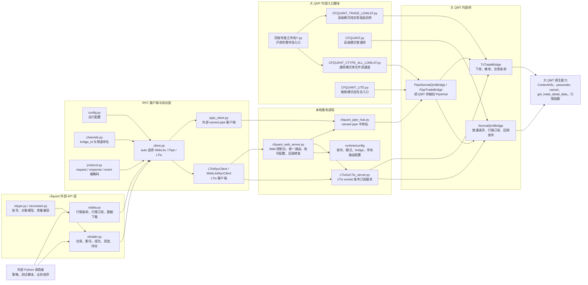
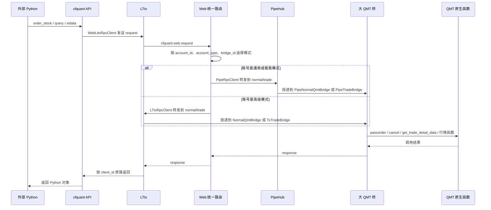
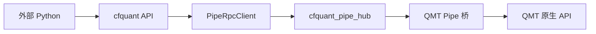
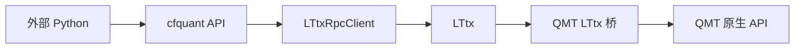
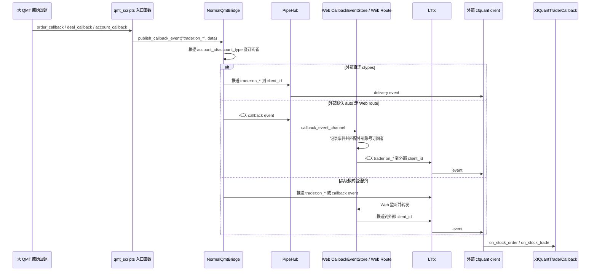
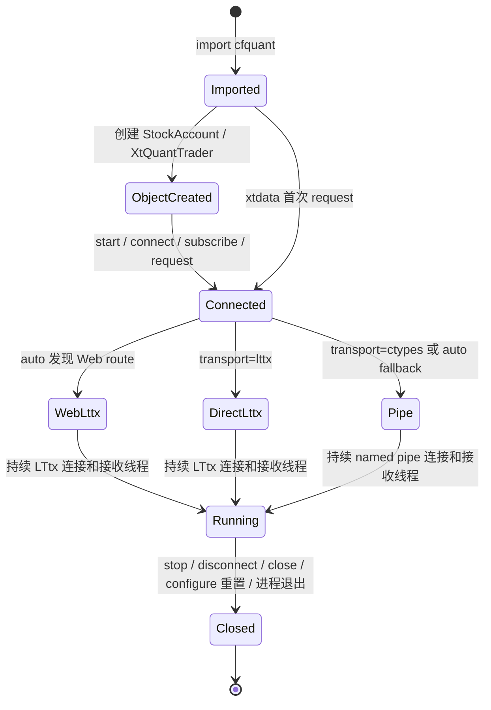

# cfquant 项目架构图

本文用于快速理解 cfquant 的整体架构、不同部署模式下的请求链路、回调链路，以及各代码模块的职责。更细的交易链路和回调机制说明见 [cfquant_qmt_architecture_and_callbacks.md](cfquant_qmt_architecture_and_callbacks.md)。

## 总体架构



## 请求链路

### 默认 auto 链路

默认 `CFQUANT_TRANSPORT=auto`。如果 Web 服务在线并通过 LTtx 发布了 `cfquant.runtime`，外部 Python 会先连 LTtx，再进入 Web 统一路由。



### 强制 ctypes 链路

强制 `configure(transport="ctypes")` 时，外部 Python 不经过 LTtx 和 Web 统一路由，直接连接 PipeHub。



这条链路更短，但调用方需要自己处理账号、bridge、模式和市场路由配置。

### 强制 lttx 链路

强制 `configure(transport="lttx")` 时，外部 Python 直接连 LTtx 请求频道，绕过 Web 账号路由。



这条链路适合固定高级模式和明确频道的场景，不具备 Web 的账号自动路由和 fallback。

## 回调链路

交易回调分为两类：账号级广播回调和请求级响应回调。

账号级广播回调包括：

- `on_stock_order`
- `on_stock_trade`
- `on_stock_asset`
- `on_stock_position`
- `on_order_error`
- `on_cancel_error`，是否能被 QMT 触发取决于当前 QMT 是否绑定该原始回调名

请求级响应回调包括：

- `on_order_stock_async_response`
- `on_cancel_order_stock_async_response`
- 数据下载进度 callback
- 行情订阅的 `quote:<subscribe_id>`



关键规则：

- 同步下单、撤单、查询的 `response` 只回给发起请求的 `client_id`。
- 账号级交易回调按 `bridge_id + account_type + account_id` 广播给所有已 `subscribe(account)` 的客户端。
- 高级模式中的 `CFQUANT_TRADE_LOWLAT.py` 是纯交易请求桥，不承接 QMT 原始 `order_callback/deal_callback`。高级模式的账号级回调由 `CFQUANT.py` 普通桥负责。

## 模式架构图

```mermaid
flowchart TB
    subgraph Common["通用模式 ctypes"]
        C1["外部 auto/Web 或 direct ctypes"]
        C2["PipeHub"]
        C3["CFQUANT_CTYPE_ALL_LOWLAT.py"]
        C4["PipeNormalQmtBridge<br/>normal: 行情、查询、回调"]
        C5["PipeTradeBridge<br/>trade: 下单、撤单、交易查询"]
        C1 --> C2 --> C3
        C3 --> C4
        C3 --> C5
    end

    subgraph Lite["极致模式 lite"]
        L1["外部 auto/Web 或 direct lite"]
        L2["PipeHub"]
        L3["CFQUANT_LITE.py<br/>自包含"]
        L1 --> L2 --> L3
    end

    subgraph Advanced["高级模式 lttx"]
        A1["外部 auto/Web 或 direct lttx"]
        A2["LTtx"]
        A3["CFQUANT.py<br/>普通桥、行情、回调"]
        A4["CFQUANT_TRADE_LOWLAT.py<br/>纯交易请求桥"]
        A1 --> A2
        A2 --> A3
        A2 --> A4
    end

    subgraph Market["同账号独立市场"]
        M1["Web 市场路由"]
        M2["SH bridge"]
        M3["SZ bridge"]
        M1 --> M2
        M1 --> M3
    end
```



## 组件和模块职责

| 模块或组件 | 路径 | 主要职责 |
|---|---|---|
| 外部 API 总入口 | `cfquant/__init__.py` | 对外暴露 `xtdata`、`xttrader`、`xttype`、`configure` 等兼容入口 |
| 交易兼容层 | `cfquant/xttrader.py` | 模拟 `xtquant.xttrader`，负责 `XtQuantTrader`、账号订阅、下单、撤单、交易查询、交易回调派发 |
| 行情兼容层 | `cfquant/xtdata.py` | 模拟 `xtquant.xtdata`，负责行情查询、行情订阅、数据下载、条件兼容接口 |
| 类型和常量 | `cfquant/xttype.py`、`cfquant/xtconstant.py` | 提供 `StockAccount`、资产、委托、成交、持仓对象和交易常量 |
| 全局配置 | `cfquant/config.py` | 读取和维护 host、port、token、transport、pipe name、bridge id 等客户端配置 |
| 频道命名 | `cfquant/channels.py` | 根据 `bridge_id` 生成 normal、trade、callback 频道 |
| 协议编解码 | `cfquant/protocol.py` | 统一封装 `request`、`response`、`event`，并处理对象、DataFrame、Series 的序列化 |
| RPC 客户端选择 | `cfquant/client.py` | 根据 `transport=auto/ctypes/lttx/web_lttx` 创建 `PipeRpcClient`、`LTtxRpcClient` 或 `WebLttxRpcClient` |
| 外部 Pipe 客户端 | `cfquant/pipe_client.py` | 外部 Python 直连 PipeHub 时使用，维护 `api_rx/api_tx` 两条 pipe 连接和事件分发线程 |
| Pipe 底层传输 | `cfquant/pipe_transport.py` | Windows named pipe 的创建、连接、frame 读写，以及 QMT 侧 `PipeTxClient` 适配器 |
| PipeHub 核心 | `cfquant/pipe_hub.py` | 作为外部 Python/Web 和 QMT Pipe 桥之间的 named pipe 消息代理，负责请求转发、响应配对、事件投递和状态文件 |
| PipeHub 启动入口 | `cfquant_pipe_hub.py` | 独立启动 PipeHub 的命令行入口，通常由 Web 服务自动维护 |
| LTtx 客户端封装 | `cfquant/tx.py`、`LTtx/tx/tx.py` | LTtx socket 客户端能力，提供 `start_tx`、`start_txg`、`push`、`put`、`get` 等 |
| LTtx 服务端 | `LTtx/tx/LTtx_server.py` | 本机 LTtx 发布订阅服务，用于 Web route、运行时发现、高级模式直连 |
| Web 服务 | `cfquant_web_server.py` | Web 控制台、账号配置、运行时注册、统一路由、PipeHub 启停、LTtx 启停、callback 监听、WebSocket 推送 |
| 账号订阅表 | `cfquant/account_routing.py` | 维护 `bridge_id + account_type + account_id -> client_id` 的订阅关系，辅助回调广播 |
| 交易桥基类 | `cfquant/tx_trade_bridge.py` | QMT 侧交易请求分发，支持 `passorder`、`cancel`、交易查询、行情兼容查询、账号订阅和请求级事件 |
| 普通桥 | `cfquant/normal_bridge.py` | 在交易桥基础上增加普通请求队列、行情订阅转发、callback event 通道和 QMT 原始交易回调发布 |
| Pipe 桥 | `cfquant/pipe_bridge.py` | 把 `NormalQmtBridge` 和 `TxTradeBridge` 包装成通过 PipeHub 通信的 QMT 侧桥 |
| 旧 LTtx 桥 | `cfquant/qmt_bridge.py` | 早期 QMT 侧 LTtx 桥兼容实现，保留部分旧部署兼容能力 |
| 通用模式 QMT 入口 | `qmt_scripts/CFQUANT_CTYPE_ALL_LOWLAT.py` | 单个 QMT 策略内启动 normal/trade 两个 Pipe 通道，支持请求、行情和账号级回调 |
| 高级模式普通桥入口 | `qmt_scripts/CFQUANT.py` | 高级模式普通 QMT 入口，负责普通查询、行情和账号级交易回调 |
| 高级模式交易桥入口 | `qmt_scripts/CFQUANT_TRADE_LOWLAT.py` | 高级模式低延迟交易入口，只处理下单、撤单、交易查询，不承接 QMT 原始账号回调 |
| 极致模式入口 | `qmt_scripts/CFQUANT_LITE.py` | 自包含 QMT 入口，适配无法正常导入项目 `cfquant` 包的 QMT 环境 |
| 独立市场入口 | `qmt_scripts/同账号独立市场/*.py` | 内置对应主入口代码并设置沪/深市场配置，让 Web 可把同一账号不同市场拆到不同 bridge |
| 测试脚本 | `cfquant/tests/*.py` | 覆盖行情接收、数据获取、数据下载、交易查询、真实下单、回调监听等场景 |
| 运行时目录 | `runtime/` | 保存配置、状态、缓存、报告、截图、LTtx 临时数据等运行时文件 |
| Web 前端 | `web_dashboard/` | 本地控制台页面，展示账号、桥状态、版本、配置和回调事件 |

## 关键运行数据

| 数据 | 默认位置或名称 | 作用 |
|---|---|---|
| Web 配置 | `runtime/config/cfquant_web_config.json` | 保存账号、账号类型、bridge、运行模式、市场路由、Web 端口等配置 |
| Pipe 名称 | `\\.\pipe\cfquant_pipe_hub` | 外部 Pipe 客户端、Web 和 QMT Pipe 桥连接的 named pipe |
| LTtx host/port | `127.0.0.1:2049` | Web route、高级模式和运行时发现使用 |
| Web route 频道 | `cfquant.web.request` | 外部 `auto` 命中 Web 路由后的统一请求入口 |
| 默认 normal 频道 | `cfquant.normal.request` | 普通查询、行情、普通桥请求 |
| 默认 trade 频道 | `cfquant.trade.request` | 下单、撤单、低延迟交易查询 |
| 默认 callback 频道 | `cfquant.callback.event` | QMT 原始交易回调发布给 Web 监听器的事件通道 |
| 运行时发现 key | `cfquant.runtime` | Web 写入 LTtx，外部 `auto` 读取后决定是否走 Web route |

## 连接生命周期



要点：

- `import cfquant` 不会连接 LTtx。
- 默认 `auto + Web 在线` 时，第一次请求后外部调用者会持续连接 LTtx 的 Web route。
- 强制 `ctypes/lite` 时，外部调用者持续连接 PipeHub，不直接连接 LTtx。
- Web 服务自身会维护 LTtx 和必要的 PipeHub，这和外部调用者是否直连 LTtx是两个不同概念。

## 推荐使用方式

普通用户和多账号部署建议保持默认：

```text
外部 cfquant -> LTtx -> Web 统一路由 -> 账号对应桥 -> 大 QMT
```

这样 Web 统一管理账号、模式、bridge、市场路由、fallback 和回调转发。

固定单账号、明确只走通用模式并追求更短链路时，可以使用：

```python
from cfquant import configure

configure(transport="ctypes")
```

但这种方式会绕过 Web 统一路由，调用方需要自行维护账号和 bridge 关系。
